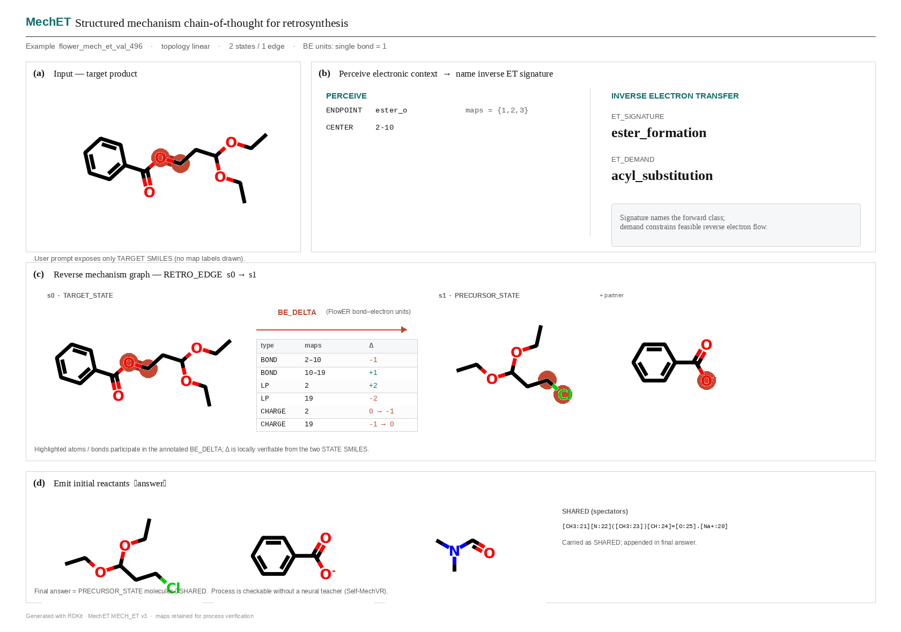

# MechET

**Verifiable mechanism chain-of-thought for retrosynthesis.**

[](https://www.python.org/)
[](LICENSE)
[](https://www.rdkit.org/)

From a mapped **product SMILES**, MechET trains an LLM to emit a reverse FlowER mechanism graph with explicit bond–electron deltas (`BE_DELTA`), then answer with the **initial reactants**. The graph is the verifiable CoT; the reactants are the task output.

```text
product  →  PERCEIVE / ET_SIGNATURE  →  STATE · RETRO_EDGE · BE_DELTA  →  reactants
```

<p align="center">
  
</p>
<p align="center"><em>Figure 1. Structured CoT: product → ET signature → locally checkable BE_DELTA → reactants.</em></p>

## What this is

1. **Representation** — `MECH_ET v3`: full reverse mechanism graphs (chain / tree / DAG) with per-edge `BE_DELTA` (FlowER units: single bond = 1), then precursor SMILES.
2. **Self-induced process verification** — Correct \(\Delta BE\) is determined analytically from student `STATE` pairs (RDKit). Dense rewards need no LLM teacher or FlowER neural forward pass.
3. **Self-MechVR** — SFT on gold CoT, then teacher-free on-policy RLVR gated by \(\mathcal{F}=\{\text{format}\wedge\text{reachability}\wedge\text{e-conserved}\}\).
4. **Analysis** — Topology-split eval (linear / tree / DAG) and ablations (`−BE` / `−conserv` / outcome-only / SFT-only).

| Design | Role |
|---|---|
| FlowER elementary steps | Official DiGraph semantics |
| `BE_DELTA` | Explicit arrow-pushing (bond / LP / charge) |
| `SHARED` + strip-H `STATE` | Compress long system SMILES |
| Local process rewards | format · reachability · BE · conservation · answer |

## Install

```bash
git clone git@github.com:wangyu-sd/MechET.git
cd MechET
pip install -e ".[dev]"
# Training extras: transformers, peft, datasets, bitsandbytes, accelerate
```

## Quickstart

```bash
# 1) Peek a gold sample
python - <<'PY'
import json
print(open("data/samples/valid_mini.jsonl").readline()[:500])
PY

# 2) Build SFT from FlowER  (download notes → data/README.md)
python scripts/build_mechet_sft.py \
  --flower-root "${FLOWER_ROOT:-/path/to/flower_new_dataset}" \
  --out-dir data/mechet_sft \
  --splits train valid test

# Resume: add --resume
# 3) Evaluate gold CoT
python scripts/eval_mechet.py --data data/mechet_sft/valid.jsonl --limit 200

# 4) Train (Qwen + QLoRA); assistant-only CE (user/system labels = -100)
export QWEN_MODEL_PATH=/path/to/local/qwen
python scripts/train_mechet_sft.py --config configs/overfit32.yaml
```

## Datasets

| Corpus | Role | Download |
|---|---|---|
| **FlowER** `flower_new_dataset` | Required for MechET SFT | [Figshare](https://doi.org/10.6084/m9.figshare.32513667) · [FlowER repo](https://github.com/FongMunHong/FlowER) |
| USPTO-50K | Optional retro benchmark | [GLN](https://github.com/Hanjun-Dai/GLN) · [DeepChem CSV](https://deepchemdata.s3.us-west-1.amazonaws.com/datasets/USPTO_50K.csv) |
| USPTO-MIT | Optional (~479k) | [RexGen](https://github.com/wengong-jin/nips17-rexgen) · [DeepChem CSV](https://deepchemdata.s3.us-west-1.amazonaws.com/datasets/USPTO_MIT.csv) |

Commands, paths, and `build_mechet_sft.py` details: **[data/README.md](data/README.md)**.

## Method: Self-MechVR

```text
SFT (gold MECH_ET)  →  on-policy rollouts  →  local verifier rewards  →  GRPO / RLOO-style RLVR
```

Teacher-free: every training signal is local (grammar + RDKit), not an external model.

| Signal | Source | External model? |
|---|---|---|
| format / parse | `MECH_ET v3` grammar | No |
| reachability | reverse graph walk | No |
| BE exact | \(\Delta BE\) from `STATE` pair vs written `BE_DELTA` | No (RDKit) |
| electron conserved | \(\sum\Delta BE \approx 0\) | No |
| answer | precursors ↔ `PRECURSOR_STATE` | No |

## CoT schema (`MECH_ET v3`)

```text
<mechanism>
MECH_ET v3
TARGET_SMILES "<product>"
PERCEIVE / ET_SIGNATURE / ET_DEMAND
STATE s0 "..." ; STATE s1 "..." ; SHARED "..."
RETRO_EDGE s0 s1
  BE_DELTA
    BOND i j ±d | LP i ±d | CHARGE i q0 q1
</mechanism>
<answer> <initial reactants> </answer>
```

On edge \(a\to b\): \(\Delta BE = BE(b)-BE(a)\). Full examples: `data/samples/`. Visualize: `scripts/visualize_mechet_cot.py`.

## Layout

```text
src/mechet/     # graph · BE · SFT format · verifier
scripts/        # build · eval · train · visualize
configs/        # overfit32 · sft_pilot
data/samples/   # tiny gold JSONL
docs/           # CoT figure
```

## Tests

```bash
export PYTHONPATH=src
export FLOWER_VAL=/path/to/flower_new_dataset/val.txt   # required for full suite
pytest -q tests/test_mech_et.py
```

## Relation to FlowER

FlowER supplies elementary-step trajectories and BE-matrix semantics. MechET turns them into LLM-trainable reverse CoT for reactant prediction (extracted from the broader ORBIT / Reflow track).

## Citation

```bibtex
@misc{mechet2026,
  title        = {MechET: Mechanism Electron-Transfer CoT and Self-MechVR for Retrosynthesis},
  author       = {wangyu-sd},
  year         = {2026},
  howpublished = {\url{https://github.com/wangyu-sd/MechET}}
}
```

Please also cite [FlowER](https://github.com/FongMunHong/FlowER).

## License

MIT — see [`LICENSE`](LICENSE).
