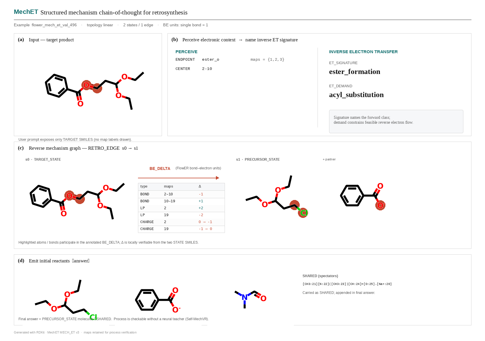

# MechET

**Verifiable mechanism reasoning and proof-carrying retrosynthesis.**

[](https://www.python.org/)
[](LICENSE)
[](https://www.rdkit.org/)

From a mapped **product SMILES**, MechET trains an LLM to emit a reverse FlowER mechanism graph with explicit bond–electron deltas (`BE_DELTA`). The original `MECH_ET v3` path emits annotated states and a precursor answer. The experimental `MECH_PROOF v1` path emits only executable electron-flow operations; its precursor is derived by an independent RDKit executor.

```text
MECH_ET v3:    product → STATE · RETRO_EDGE · BE_DELTA → generated answer
MECH_PROOF v1: product → executable electron-flow proof → executor-derived precursor
```

<p align="center">
  
</p>
<p align="center"><em>Figure 1. Structured CoT: product → ET signature → locally checkable BE_DELTA → reactants.</em></p>

## What this is

1. **Representation** — `MECH_ET v3`: full reverse mechanism graphs (chain / tree / DAG) with per-edge `BE_DELTA` (FlowER units: single bond = 1), then precursor SMILES.
2. **Self-induced process verification** — Correct \(\Delta BE\) is determined analytically from student `STATE` pairs (RDKit). Dense rewards need no LLM teacher or FlowER neural forward pass.
3. **Self-MechVR** — SFT on gold CoT, then teacher-free on-policy RLVR with strict local state-transition verification.
4. **Proof-carrying path** — `MECH_PROOF v1` removes model-authored intermediate states and the independent answer channel. A deterministic executor reconstructs all states and derives the precursor.
5. **Analysis** — Topology-split eval (linear / tree / DAG) and ablations (`−BE` / `−conserv` / outcome-only / SFT-only / proof-only).

| Design | Role |
|---|---|
| FlowER elementary steps | Official DiGraph semantics |
| `BE_DELTA` | Explicit arrow-pushing (bond / LP / charge) |
| Strict local verifier | state-pair-derived delta · conservation · answer/state agreement |
| `MECH_PROOF v1` | action-only proof program; no free precursor answer |
| Proof executor | reconstructs DAG states and returns the precursor |

## Install

```bash
git clone git@github.com:wangyu-sd/MechET.git
cd MechET
pip install -e ".[dev]"
# Training extras: transformers, peft, datasets, bitsandbytes, accelerate
```

## Quickstart

```bash
# 1) Peek a gold sample
python - <<'PY'
import json
print(open("data/samples/valid_mini.jsonl").readline()[:500])
PY

# 2) Build MECH_ET v3 SFT from FlowER
python scripts/build_mechet_sft.py \
  --flower-root "${FLOWER_ROOT:-/path/to/flower_new_dataset}" \
  --out-dir data/mechet_sft \
  --splits train valid test

# 3) Carve overfit32 smoke slice (not a formal split)
python scripts/make_mechet_overfit32.py --src data/mechet_sft/valid.jsonl

# 4) Gold audit (data QC, not model scores)
python scripts/audit_mechet_gold.py --data data/mechet_sft/valid.jsonl --limit 200

# 5) MECH_ET v3 model eval
export QWEN_MODEL_PATH=/path/to/local/qwen
python scripts/run_mechet_eval.py \
  --data data/mechet_sft/valid.jsonl \
  --adapter outputs/mechet_sft/adapter \
  --out-dir outputs/mechet_eval/valid_run \
  --use-vllm \
  --tensor-parallel-size 2

# 6) Train MECH_ET v3 SFT
python scripts/train_mechet_sft.py --config configs/overfit32.yaml
python scripts/train_mechet_sft.py --config configs/sft_pilot.yaml

# 7) Self-MechVR after SFT
python scripts/train_mechet_rlvr.py --config configs/rlvr_overfit32.yaml --dry-run
python scripts/train_mechet_rlvr.py --config configs/rlvr_overfit32.yaml
python scripts/train_mechet_rlvr.py --config configs/rlvr_pilot.yaml

# 8) Compile v3 trajectories into proof-only SFT
python scripts/build_mechet_proof_sft.py \
  --input-dir data/mechet_sft \
  --output-dir data/mechet_proof_sft \
  --splits train valid test

# 9) Train proof-only SFT with the existing generic trainer
python scripts/train_mechet_sft.py --config configs/proof_sft_pilot.yaml

# 10) Infer proofs and evaluate executor-derived precursors
python scripts/infer_mechet_proof.py \
  --data data/mechet_proof_sft/valid.jsonl \
  --adapter outputs/mechet_proof_sft_pilot/adapter \
  --out outputs/mechet_proof_eval/generations.jsonl
python scripts/eval_mechet_proof_generations.py \
  --data data/mechet_proof_sft/valid.jsonl \
  --predictions outputs/mechet_proof_eval/generations.jsonl \
  --out outputs/mechet_proof_eval/summary.json
```

## Datasets

| Corpus | Role | Download |
|---|---|---|
| **FlowER** `flower_new_dataset` | Required for MechET SFT | [Figshare](https://doi.org/10.6084/m9.figshare.32513667) · [FlowER repo](https://github.com/FongMunHong/FlowER) |
| USPTO-50K | Optional retro benchmark | [GLN](https://github.com/Hanjun-Dai/GLN) · [DeepChem CSV](https://deepchemdata.s3.us-west-1.amazonaws.com/datasets/USPTO_50K.csv) |
| USPTO-MIT | Optional (~479k) | [RexGen](https://github.com/wengong-jin/nips17-rexgen) · [DeepChem CSV](https://deepchemdata.s3.us-west-1.amazonaws.com/datasets/USPTO_MIT.csv) |

Commands, paths, and `build_mechet_sft.py` details: **[data/README.md](data/README.md)**.

## Benchmarks (retrosynthesis & planning)

Compared on **`flower_completion`** test (28,971): main product → full precursor multiset, **top-k strict EM**.

| Model | top1 strict | top10 strict | Status |
|-------|-------------|--------------|--------|
| Graph2SMILES | 2.90% | 3.75% | ✅ usable (reflow baseline) |
| RxnGraphormer (main_product) | 5.30% | 10.54% | ✅ usable |
| Molecular Transformer | ~0.02% | ~0.03% | ✅ usable (strict baseline) |
| **MechET v3** | — | — | pending model eval |
| **MechET-Proof v1** | — | — | experimental proof-only path |
| FlowER-Retro | 28.9% @218k | — | 🔁 wrong split — rerun on completion |
| PaRoutes n1/n5 planning | — | — | 🔁 not run formally |

Full inventory: **[docs/BENCHMARK_RESULTS.md](docs/BENCHMARK_RESULTS.md)** · eval scripts: **[docs/EVAL.md](docs/EVAL.md)**

## Method: Self-MechVR

```text
SFT (gold MECH_ET) → on-policy rollouts → strict local verifier rewards → group-relative RLVR
```

Teacher-free: every process signal is local (grammar + RDKit), not an external model.

| Signal | Source | External model? |
|---|---|---|
| format / parse | `MECH_ET v3` grammar | No |
| reachability | reverse graph walk | No |
| local transition | \(BE(s_{t+1})-BE(s_t)\) vs written `BE_DELTA` | No |
| electron conservation | exact full-matrix delta | No |
| endpoint consistency | answer ↔ generated `PRECURSOR_STATE` | No |

## State-annotated schema (`MECH_ET v3`)

```text
<mechanism>
MECH_ET v3
TARGET_SMILES "<product>"
PERCEIVE / ET_SIGNATURE / ET_DEMAND
STATE s0 "..." ; STATE s1 "..." ; SHARED "..."
RETRO_EDGE s0 s1
  BE_DELTA
    BOND i j ±d | LP i ±d | CHARGE i q0 q1
</mechanism>
<answer> <initial reactants> </answer>
```

On edge \(a\to b\): \(\Delta BE = BE(b)-BE(a)\).

## Proof-carrying schema (`MECH_PROOF v1`)

```text
<proof>
MECH_PROOF v1
TARGET_SMILES "<mapped product>"
ROOT s0
  IMPORT "<mapped species already present in the root system>"
PRECURSOR_STATE sk
EDGE s0 s1
  IMPORT "<optional newly introduced mapped species>"
  BOND i j ±d
  LP i ±d
  CHARGE i q0 q1
...</proof>
```

`MECH_PROOF v1` has no `STATE` lines and no `<answer>` block. The executor starts from `TARGET_SMILES`, adds declared imports, applies each edge in dependency order, checks exact LP/bond/charge deltas and electron conservation, enforces DAG join consistency, and returns the reconstructed `PRECURSOR_STATE`.

This makes the proof the computation rather than an explanation attached to an independently generated answer.

## Layout

```text
src/mechet/     # graph · BE · verifier · proof compiler/executor · SFT formats
configs/        # v3 SFT/RLVR + proof SFT pilot
scripts/        # build · train · infer · eval · visualize
tests/          # unit and adversarial tests
data/samples/   # tiny gold JSONL
```

## Tests

```bash
export PYTHONPATH=src
export FLOWER_VAL=/path/to/flower_new_dataset/val.txt
pytest -q \
  tests/test_mech_et.py \
  tests/test_rlvr.py \
  tests/test_eval_cli.py \
  tests/test_proof_program.py \
  tests/test_proof_sft.py
```

The proof tests check action-only execution, endpoint derivation without an answer channel, state-trajectory compilation, and rejection of a tampered lone-pair operation.

## Relation to FlowER

FlowER supplies elementary-step trajectories and BE-matrix semantics. `MECH_ET v3` turns them into LLM-trainable state-annotated CoT. `MECH_PROOF v1` compiles those trajectories into action-only programs for cold start, while its executor and endpoint evaluation do not require reproducing intermediate state strings.

## Citation

```bibtex
@misc{mechet2026,
  title        = {MechET: Mechanism Electron-Transfer CoT and Proof-Carrying Retrosynthesis},
  author       = {wangyu-sd},
  year         = {2026},
  howpublished = {\url{https://github.com/wangyu-sd/MechET}}
}
```

Please also cite [FlowER](https://github.com/FongMunHong/FlowER).

## License

MIT — see [`LICENSE`](LICENSE).
