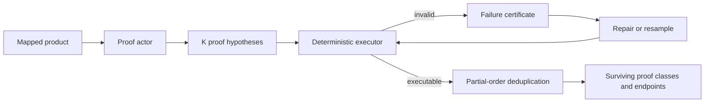

<div align="center">

# MechET

**Falsifiable retrosynthesis over executable electron-flow programs**

MechET does not generate a precursor through an independent answer channel. It generates one or more `MECH_PROOF v1` programs; a deterministic executor applies their bond–electron operations and derives the precursor.

[](https://github.com/wangyu-sd/MechET/actions/workflows/proof-tests.yml)
[](https://github.com/wangyu-sd/MechET/actions/workflows/proof-centric-tests.yml)
[](https://www.python.org/)
[](https://www.rdkit.org/)
[](LICENSE)
[](#status)

[Quickstart](#quickstart) · [Proof language](#electron-flow-proof-language) · [GFR](#generatefalsifyrepair) · [Experiments](#reproduction-pipeline) · [Documentation](#documentation)

</div>

---

## Retrosynthesis as falsifiable program search

The basic causal path is:

```text
mapped product -> MECH_PROOF v1 -> deterministic executor -> structural precursors
```

The proof-hypothesis path is:

```text
product
  -> sample K proof programs from one autoregressive actor
  -> execute and falsify every program
  -> return failure certificates for invalid programs
  -> repair locally or resample
  -> deduplicate executable programs by partial-order equivalence
  -> rank surviving mechanism classes and precursor endpoints
```


```mermaid
flowchart LR
    P[Mapped product] --> A[Proof actor]
    A --> H[K proof hypotheses]
    H --> E[Deterministic executor]
    E -->|invalid| C[Failure certificate]
    C --> R[Repair or resample]
    R --> E
    E -->|executable| D[Partial-order deduplication]
    D --> S[Surviving proof classes and endpoints]
```

| Formulation | Model output | Precursor source | Can the answer bypass the reasoning? |
|---|---|---|---|
| Outcome-only | precursor | generated directly | yes |
| State-CoT | states + precursor | generated directly | yes |
| **MechET** | executable proof program | **deterministic execution** | **no** |

## What K proof hypotheses mean

For one product \(P\), the same Proof Actor is sampled repeatedly:

```text
pi_1, ..., pi_K ~ p_theta(proof | P)
```

`K` is a sampling budget, not a number of stored reaction templates. The raw samples may include:

- the same mechanism written with different state names or atom-map labels;
- the same endpoint reached through different executable mechanism classes;
- different structural precursor endpoints;
- malformed or chemically non-executable programs.

Every candidate is executed. Executable candidates are deduplicated using a partial-order signature that is invariant to state names, atom-map labels, serialized edge order, and commuting independent events. A typical report therefore looks like:

```text
128 generated
 -> 91 parseable
 -> 43 executable
 -> 14 unique executable proof classes
 -> 6 unique structural precursor endpoints
```

The principal set-valued metrics are `ExecutePass@K`, `EndpointPass@K`, unique executable proof classes, unique mechanism compositions, and unique structural endpoints. Top-1 is retained for literature comparability, not used as the sole objective.

## Electron-flow proof language

`MECH_PROOF v1` is a sparse program over atom-mapped molecular graphs:

```text
<proof>
MECH_PROOF v1
TARGET_SMILES "<mapped product>"
ROOT s0
  IMPORT "<mapped species present in the root system>"
PRECURSOR_STATE sk
EDGE s0 s1
  IMPORT "<optional introduced mapped species>"
  BOND i j ±d
  LP i ±d
  CHARGE i q0 q1
...
</proof>
```

The operations are **local executable primitives**, not fixed whole-reaction templates:

- `IMPORT`: introduce a mapped species required by an elementary transition;
- `BOND i j delta`: change bond order between mapped atoms;
- `LP i delta`: declare the corresponding change in non-bonding electrons;
- `CHARGE i q0 q1`: apply a checked formal-charge transition;
- `EDGE src dst`: define an elementary transition in a chain, tree, or DAG proof.

For each edge, the executor applies graph-changing operations, reconstructs the destination state, recomputes the bond–electron delta, verifies the written `BOND`, `LP`, and `CHARGE` records, checks electron conservation, sanitizes the molecular state, and enforces consistent DAG joins.

This is a bond–electron redistribution representation. It does not yet uniquely pair every electron source orbital with every electron sink orbital. Explicit source-to-sink `E_MOVE` operations, one-electron radical moves, metal orbitals, spin states, and coordination changes are future extensions for catalytic-cycle discovery.

The current cold-start corpus is compiled from FlowER trajectories, so it inherits mechanistic priors from that data-construction process even though inference does not retrieve or instantiate a fixed reaction template.

See [the proof-language specification](docs/PROOF_CARRYING.md).

## Generate–Falsify–Repair

MechET-GFR separates four learned or deterministic roles:

1. **Proof Actor** — samples complete `MECH_PROOF v1` programs.
2. **Formal executor/falsifier** — deterministic and never trained.
3. **Repair Actor** — receives an invalid proof and a structured failure certificate, then proposes a local correction.
4. **External plausibility layer** — optional precedent, condition, energy, kinetic, expert, or experimental evidence applied only after formal execution.

The executor may reject a proof for stable reasons such as:

```text
PROOF_PARSE_FAILED
ATOM_MAP_ERROR
BOND_EXECUTION_MISMATCH
LP_EXECUTION_MISMATCH
CHARGE_PRECONDITION_FAILED
ELECTRON_NOT_CONSERVED
CHEMICAL_STATE_INVALID
UNREACHABLE_EDGE
DAG_JOIN_MISMATCH
```

GFR inference allows at most a small fixed number of repair rounds. A proof that still fails is discarded or resampled rather than edited indefinitely.

## What is implemented

- executable `MECH_PROOF v1` compiler, parser, executor, and verifier;
- chain/tree/DAG proof execution and DAG-join checks;
- structural-precursor scoring separated from solvents, salts, catalysts, and spectators;
- FlowER–USPTO overlap audit and training-set decontamination;
- partial-order proof equivalence and MechComp-OOD splits;
- verified equivalence augmentation;
- controlled proof corruptions and formal falsification benchmarks;
- verifier-grounded preference data and Verifier-DPO training;
- accuracy-mode and hypothesis-mode proof-set RLVR;
- certificate-conditioned repair data, training, and GFR inference;
- hypothesis-set execution, deduplication, endpoint grouping, and Pass@K evaluation;
- proof-carrying best-first multistep search over an offline candidate pool;
- executable reaction-hypergraph and formal catalytic-cycle validation scaffolds;
- typed interfaces for external plausibility evidence.

## Status

MechET is a research preview. The software and experimental scaffold are available; public trained checkpoints and paper-scale scientific results are not yet released.

| Artifact | Status |
|---|---|
| Proof language, compiler, executor, verifier | available |
| Partial-order equivalence and MechComp-OOD | available |
| Leakage audit and decontamination | available |
| Proof curriculum, Verifier-DPO, proof-set RLVR | available |
| Hypothesis-set and GFR inference | available |
| Proof-carrying route-search scaffold | available |
| Reaction-network and catalytic-cycle formal scaffolds | available |
| Public trained checkpoints | not released |
| Frozen paper-scale result tables | not released |
| DFT, microkinetic, or experimental validation | external work required |

## Quickstart

### Install

```bash
git clone https://github.com/wangyu-sd/MechET.git
cd MechET
pip install -e ".[dev]"
```

### Execute one proof

```python
from mechet import ChargeAction, ProofEdge, ProofProgram
from mechet import format_proof_output, verify_proof

program = ProofProgram(
    target_smiles="[CH3:1][OH:2]",
    roots={"s0": ["[Br-:3]"]},
    precursor_state_id="s1",
    edges=[ProofEdge(
        "s0", "s1",
        bonds=[(1, 2, -1), (1, 3, +1)],
        lone_pairs=[(2, +2), (3, -2)],
        charges=[
            ChargeAction(2, 0, -1),
            ChargeAction(3, -1, 0),
        ],
    )],
)

proof = format_proof_output(program)
score = verify_proof(
    proof,
    expected_precursor="[CH3:1][Br:3].[OH-:2]",
)
print(score["execute_ok"], score["endpoint_exact"])
```

Expected output:

```text
True True
```

The precursor is produced by the executor. There is no `<answer>` block.

## Reproduction pipeline

The authoritative experimental contract is [docs/PROOF_CENTRIC_EXPERIMENT_PLAN.md](docs/PROOF_CENTRIC_EXPERIMENT_PLAN.md). The machine-readable checkpoint and data lineage is in `configs/proof/proof_pipeline.yaml`.

### 1. Compile and audit proof data

```bash
python scripts/build_mechet_sft.py \
  --flower-root /path/to/flower_new_dataset \
  --out-dir data/mechet_sft \
  --splits train valid test

python scripts/build_mechet_proof_sft.py \
  --input-dir data/mechet_sft \
  --output-dir data/mechet_proof_sft \
  --splits train valid test

python scripts/audit_reaction_overlap.py \
  --train data/mechet_proof_sft/train.jsonl \
  --benchmark data/benchmarks/uspto50k/test.csv \
  --benchmark-format reaction_table \
  --reaction-field reaction_smiles \
  --out-dir outputs/data_audit/flower_vs_uspto50k_test
```

### 2. Build the proof curriculum

```bash
python scripts/build_proof_equivalence_data.py \
  --input data/mechet_proof_clean/train.jsonl \
  --output data/proof_curriculum/equivalence_train.jsonl \
  --variants-per-row 4

python scripts/build_proof_corruption_data.py \
  --input data/mechet_proof_clean/train.jsonl \
  --output data/proof_curriculum/corruptions.jsonl \
  --include-valid-controls

python scripts/build_proof_preferences.py \
  --corruptions data/proof_curriculum/corruptions.jsonl \
  --output data/proof_curriculum/preferences.jsonl

python scripts/build_proof_repair_data.py \
  --corruptions data/proof_curriculum/corruptions.jsonl \
  --output data/proof_curriculum/repairs.jsonl
```

### 3. Train the actor and repair models

```bash
export QWEN_MODEL_PATH=/path/to/Qwen3-8B

python scripts/train_mechet_sft.py \
  --config configs/proof/proof_actor_sft.yaml

python scripts/train_proof_dpo.py \
  --config configs/proof/proof_dpo.yaml

python scripts/train_proof_repair.py \
  --config configs/proof/proof_repair.yaml
```

Proof-set RLVR has separate accuracy and hypothesis-diversity modes:

```bash
python scripts/train_iclr_proof_rlvr.py \
  --config configs/proof/proof_rlvr_accuracy.yaml --dry-run

python scripts/train_proof_rlvr_distributed.py \
  --config configs/proof/proof_rlvr_hypothesis.yaml \
  --mode rollout \
  --input data/mechet_proof_clean/train.jsonl \
  --output outputs/proof/rlvr_iter0/rollouts.jsonl \
  --adapter outputs/proof/actor_dpo/adapter
```

### 4. Generate and evaluate proof sets

```bash
python scripts/infer_proof_hypotheses.py \
  --data data/mechet_proof_clean/test.jsonl \
  --adapter outputs/proof/actor_dpo/adapter \
  --samples-per-target 64 \
  --out outputs/proof/hypotheses.jsonl

python scripts/infer_proof_gfr.py \
  --data data/mechet_proof_clean/test.jsonl \
  --actor-adapter outputs/proof/actor_dpo/adapter \
  --repair-adapter outputs/proof/repair/adapter \
  --samples-per-target 16 \
  --max-repairs 2 \
  --out outputs/proof/gfr.jsonl

python scripts/eval_proof_hypotheses.py \
  --predictions outputs/proof/hypotheses.jsonl \
  --k 1 4 16 64 \
  --out outputs/eval/hypotheses.json

python scripts/eval_proof_falsification.py \
  --data data/proof_curriculum/corruptions.jsonl \
  --out outputs/eval/falsification.json

python scripts/eval_proof_repair.py \
  --predictions outputs/proof/gfr.jsonl \
  --out outputs/eval/repair.json
```

## Required result families

A complete ICLR-stage evaluation must include all of the following; a high Top-1 alone is insufficient.

| Result family | Required evidence |
|---|---|
| Data integrity | FlowER–USPTO overlap matrix, removal counts, frozen hashes, and retained split sizes |
| Endpoint comparability | Top-1/Top-k structural precursor results for matched Outcome-only, State-CoT, Net-edit, Proof-SFT, Proof-DPO, and MechET-GFR models |
| Formal falsification | FAR, FRR, failure-code accuracy, and first-failing-edge localization over controlled corruptions |
| Hypothesis search | ExecutePass@K, EndpointPass@K, executable proof classes@K, mechanism compositions@K, and endpoints@K |
| Faithfulness | rate of answer–reasoning disagreement for answer-bearing baselines versus structural impossibility of bypass in MechET |
| Invariance | atom-map, state-name, serialization, commuting-order, and synchronized random-SMILES controls |
| Compositional OOD | primitive-seen/composition-unseen MechComp-OOD results by proof length and topology |
| Repair | repair@1/@2, over-edit rate, new-error introduction, and endpoint retention |
| Efficiency | assistant tokens, GPU hours, inference latency, executor overhead, and valid hypotheses per sampling budget |
| Multistep pilot | fully verified route rate under matched search budget, solved rate, invalid expansions, search nodes, and route diversity |

The full expected tables, figures, stopping gates, and result interpretation rules are defined in the authoritative experiment plan.

## Documentation

Start with [the documentation map](docs/README.md).

- [Proof language, electron-flow semantics, and executor](docs/PROOF_CARRYING.md)
- [Authoritative proof-centric experiment plan](docs/PROOF_CENTRIC_EXPERIMENT_PLAN.md)
- [Partial-order equivalence, MechComp-OOD, and failure certificates](docs/PROOF_EQUIVALENCE.md)
- [Data leakage and benchmark-lineage protocol](docs/DATA_LEAKAGE_AND_ICLR_PLAN.md)
- [Dataset construction](data/README.md)

Deprecated and historical documents are listed, with replacements, in `docs/README.md`.

## Current boundaries

- Formal executability is not evidence of a low activation barrier, favorable kinetics, condition compatibility, precedent support, or experimental success.
- `MECH_PROOF v1` currently represents bond–electron deltas, not uniquely paired electron source-to-sink arrows.
- The executor requires atom-mapped molecular inputs.
- Current cold-start proofs inherit priors and coverage limitations from FlowER trajectory construction.
- Structural precursors are evaluated separately from reagents, solvents, catalysts, salts, and spectators.
- Reaction-network and catalytic-cycle modules currently verify formal graph and ledger properties only.
- APIs and proof grammar may evolve before a stable release.

## Relation to FlowER

FlowER supplies elementary-step trajectories and bond–electron semantics for cold-start compilation. MechET converts those trajectories into action-only programs, executes predictions independently, derives endpoints from the executor, and evaluates proof hypotheses without requiring exact reproduction of the teacher's state serialization.

## Legacy compatibility path

<details>
<summary><code>MECH_ET v3</code> state-annotated path</summary>

`MECH_ET v3` is retained for trajectory auditing, cold-start compilation, and controlled comparison experiments. It emits model-authored states and an independent precursor answer, so it is not the primary proof-carrying method.

Historical commands and metrics are intentionally not presented as the current evaluation protocol. See the deprecation notice in `docs/EVAL.md`.

</details>

## Tests

```bash
export PYTHONPATH=src
pytest -q tests/test_proof_*.py tests/test_reaction_network.py tests/test_catalytic_cycle.py
```

## Citation

The paper is in preparation. For software use:

```bibtex
@software{mechet2026,
  title  = {MechET: Falsifiable Retrosynthesis over Executable Electron-Flow Programs},
  author = {Wang, Yu},
  year   = {2026},
  url    = {https://github.com/wangyu-sd/MechET}
}
```

## License

MIT — see [LICENSE](LICENSE).
