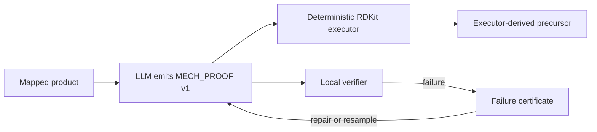

<div align="center">

# MechET

**Proof-carrying retrosynthesis with executable electron-flow programs**

A retrosynthetic proposal is accepted only when its electron-flow proof can be executed. The precursor is produced by the executor—not generated through a separate answer channel.

[](https://github.com/wangyu-sd/MechET/actions/workflows/proof-tests.yml)
[](https://www.python.org/)
[](https://www.rdkit.org/)
[](LICENSE)
[](#status)

[Quickstart](#quickstart) · [Method](#mech_proof-v1) · [Training](#training-and-evaluation) · [MechComp-OOD](#mechanism-composition-generalization) · [Docs](#documentation)

</div>

---

## Retrosynthesis as verified program synthesis

Most retrosynthesis models generate a precursor directly and may attach an explanation afterward. MechET instead uses a causal proof-to-precursor path:

```text
mapped product -> MECH_PROOF v1 -> deterministic executor -> precursor
```


```mermaid
flowchart LR
    P[Mapped product] --> M[LLM emits MECH_PROOF v1]
    M --> E[Deterministic RDKit executor]
    E --> R[Executor-derived precursor]
    M --> V[Local verifier]
    V -->|failure| C[Failure certificate]
    C -->|repair or resample| M
```

| Formulation | Model output | Precursor source | Faithfulness |
|---|---|---|---|
| Outcome-only | precursor | generated directly | not checked |
| State-CoT | states + precursor | generated directly | answer can bypass states |
| **MechET** | executable proof only | **deterministic execution** | **enforced by construction** |

## What is implemented

- **Executable inverse electron-flow proofs:** sparse `IMPORT`, `BOND`, `LP`, and `CHARGE` operations over chain/tree/DAG structures.
- **Strict local verification:** atom maps, bond/lone-pair/charge transitions, sanitizable states, electron conservation, reachability, and DAG joins.
- **Proof-level learning:** proof-only SFT and proof-aware RLVR without exact intermediate teacher-trace matching.
- **Partial-order equivalence:** ignores state names, atom-map labels, edge serialization, and ordering of independent events.
- **MechComp-OOD:** unseen full mechanism compositions built from training-covered elementary primitives.
- **Failure certificates and repair:** structured first-failure diagnostics and deterministic LP-certificate correction.

## Status

MechET is a research preview. The proof infrastructure is available; public checkpoints and paper-scale results are still in progress.

| Artifact | Status |
|---|---|
| Proof language, compiler, executor, verifier | available |
| Proof-only SFT and proof-aware RLVR | available |
| Partial-order equivalence and MechComp-OOD | available |
| Deterministic LP repair | available |
| Public pretrained checkpoint | not released yet |
| Paper-scale benchmark table | in progress |
| Proof-guided multistep planning | planned |

## Quickstart

### Install

```bash
git clone https://github.com/wangyu-sd/MechET.git
cd MechET
pip install -e ".[dev]"
```

### Execute a proof

```python
from mechet import ChargeAction, ProofEdge, ProofProgram
from mechet import format_proof_output, verify_proof

program = ProofProgram(
    target_smiles="[CH3:1][OH:2]",
    roots={"s0": ["[Br-:3]"]},
    precursor_state_id="s1",
    edges=[ProofEdge(
        "s0", "s1",
        bonds=[(1, 2, -1), (1, 3, +1)],
        lone_pairs=[(2, +2), (3, -2)],
        charges=[
            ChargeAction(2, 0, -1),
            ChargeAction(3, -1, 0),
        ],
    )],
)

proof = format_proof_output(program)
score = verify_proof(
    proof,
    expected_precursor="[CH3:1][Br:3].[OH-:2]",
)
print(score["execute_ok"], score["endpoint_exact"])
```

Expected output:

```text
True True
```

The proof contains no `<answer>` block; the precursor is returned by the executor.

## `MECH_PROOF v1`

```text
<proof>
MECH_PROOF v1
TARGET_SMILES "<mapped product>"
ROOT s0
  IMPORT "<mapped species present in the root system>"
PRECURSOR_STATE sk
EDGE s0 s1
  IMPORT "<optional introduced mapped species>"
  BOND i j ±d
  LP i ±d
  CHARGE i q0 q1
...
</proof>
```

For each edge, the executor applies the graph-changing operations, reconstructs the destination state, recomputes the bond-electron delta, verifies the written proof, and enforces electron conservation. All paths entering a DAG join must reconstruct the same state.

See [docs/PROOF_CARRYING.md](docs/PROOF_CARRYING.md) for the formal semantics.

## Training and evaluation

```bash
# 1. Build state-annotated cold-start trajectories from FlowER.
python scripts/build_mechet_sft.py \
  --flower-root /path/to/flower_new_dataset \
  --out-dir data/mechet_sft \
  --splits train valid test

# 2. Compile them into action-only proofs.
python scripts/build_mechet_proof_sft.py \
  --input-dir data/mechet_sft \
  --output-dir data/mechet_proof_sft \
  --splits train valid test

# 3. Train proof SFT and proof-aware RLVR.
export QWEN_MODEL_PATH=/path/to/Qwen3-8B
python scripts/train_mechet_sft.py --config configs/proof_sft_pilot.yaml
python scripts/train_mechet_rlvr.py --config configs/proof_rlvr_pilot.yaml

# 4. Generate and execute proofs.
python scripts/infer_mechet_proof.py \
  --data data/mechet_proof_sft/valid.jsonl \
  --adapter outputs/mechet_proof_rlvr_pilot/adapter \
  --out outputs/mechet_proof_eval/generations.jsonl

python scripts/eval_mechet_proof_generations.py \
  --data data/mechet_proof_sft/valid.jsonl \
  --predictions outputs/mechet_proof_eval/generations.jsonl \
  --attempt-local-repair \
  --out outputs/mechet_proof_eval/summary.json
```

| Metric | Meaning |
|---|---|
| `format_ok` | parseable proof program |
| `execute_ok` | every edge passes deterministic execution and verification |
| `endpoint_exact` | executor-derived precursor matches the reference |
| `proof_equivalent_to_gold` | equal under partial-order proof equivalence |
| `composition_match` | same target-independent mechanism composition |
| `repair_changed` | deterministic local repair modified the proof |

Metrics are also stratified by linear, tree, and DAG topology.

## Mechanism composition generalization

MechComp-OOD evaluates **seen elementary primitives, unseen complete composition**:

```bash
python scripts/build_mechcomp_ood.py \
  --input data/mechet_proof_sft/train.jsonl \
  --output-dir data/mechet_proof_mechcomp \
  --test-fraction 0.10 \
  --valid-fraction 0.10 \
  --min-train-primitive-count 5
```

The split enforces zero complete-composition overlap between train and held-out sets while retaining training coverage for every held-out elementary primitive. Signatures are invariant to state ids, atom-map labels, and commuting-event order.

See [docs/PROOF_EQUIVALENCE.md](docs/PROOF_EQUIVALENCE.md).

## Failure certificates and repair

The verifier reports the first failing stage and edge using stable codes such as:

```text
BOND_EXECUTION_MISMATCH
LP_EXECUTION_MISMATCH
CHARGE_PRECONDITION_FAILED
ELECTRON_NOT_CONSERVED
CHEMICAL_STATE_INVALID
UNREACHABLE_EDGE
DAG_JOIN_MISMATCH
```

```bash
python scripts/repair_mechet_proof_generations.py \
  --predictions outputs/mechet_proof_eval/generations.jsonl \
  --out outputs/mechet_proof_eval/generations.repaired.jsonl
```

Only LP declarations are repaired deterministically. Bond, charge, and import operations are never silently changed because they alter the proposed chemistry.

## Data and models

| Artifact | Availability |
|---|---|
| FlowER trajectories | [Figshare](https://doi.org/10.6084/m9.figshare.32513667) · [repository](https://github.com/FongMunHong/FlowER) |
| Derived state-annotated data | build locally with `build_mechet_sft.py` |
| Derived proof-only data | build locally with `build_mechet_proof_sft.py` |
| MechComp-OOD splits | build locally with `build_mechcomp_ood.py` |
| MechET checkpoint | not released yet |
| Paper-scale results | in progress |

Unverified and wrong-split experimental runs are intentionally kept out of the front page; audit notes remain in [docs/BENCHMARK_RESULTS.md](docs/BENCHMARK_RESULTS.md).

## Legacy path

<details>
<summary><code>MECH_ET v3</code> state-annotated compatibility path</summary>

`MECH_ET v3` emits full intermediate states, edge deltas, and a precursor answer. It is retained for FlowER trajectory auditing, cold-start compilation, and comparison experiments. The primary research path is `MECH_PROOF v1`.

```bash
python scripts/train_mechet_sft.py --config configs/sft_pilot.yaml
python scripts/train_mechet_rlvr.py --config configs/rlvr_pilot.yaml
python scripts/run_mechet_eval.py --help
```

</details>

## Documentation

- [Proof language and executor](docs/PROOF_CARRYING.md)
- [Partial-order equivalence, MechComp-OOD, and repair](docs/PROOF_EQUIVALENCE.md)
- [Evaluation commands](docs/EVAL.md)
- [Dataset construction](data/README.md)
- [Experiment inventory](docs/BENCHMARK_RESULTS.md)

## Tests

```bash
export PYTHONPATH=src
pytest -q \
  tests/test_mech_et.py tests/test_rlvr.py tests/test_eval_cli.py \
  tests/test_proof_program.py tests/test_proof_sft.py \
  tests/test_proof_rlvr.py tests/test_proof_equivalence.py \
  tests/test_proof_diagnostics.py tests/test_proof_splits.py
```

## Current boundaries

- Formal executability does not yet establish energetic, kinetic, condition, or precedent plausibility.
- The executor currently requires atom-mapped molecular inputs.
- Reagents, solvents, catalysts, salts, and spectators should be evaluated separately from structural precursor recovery.
- APIs and proof grammar may evolve before the first stable release.

## Relation to FlowER

[FlowER](https://github.com/FongMunHong/FlowER) supplies elementary-step trajectories and bond-electron semantics for cold-start compilation. At inference, `MECH_PROOF v1` is executed independently, the endpoint is derived by the executor, and proof RLVR does not require exact reproduction of the teacher's intermediate state trace.

## Citation

The paper is in preparation. For software use:

```bibtex
@software{mechet2026,
  title  = {MechET: Proof-Carrying Retrosynthesis with Executable Electron-Flow Programs},
  author = {Wang, Yu},
  year   = {2026},
  url    = {https://github.com/wangyu-sd/MechET}
}
```

## License

MIT — see [LICENSE](LICENSE).
