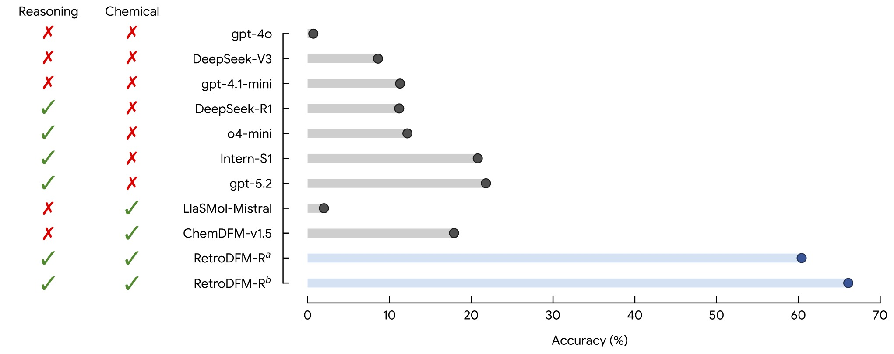

# RetroDFM-R: Reasoning-Driven Retrosynthesis Prediction with Large Language Models via Reinforcement Learning

<p align="center">
  <a href="https://arxiv.org/abs/2507.17448"></a>
  <a href="https://github.com/OpenDFM/RetroDFM-R"></a>
  <a href="https://huggingface.co/OpenDFM/RetroDFM-R-8B"></a>
  <a href="https://huggingface.co/datasets/OpenDFM/retrodfm-R-inference"></a>
</p>

## 📑 Table of Contents

- [Introduction](#introduction)
- [Repository Layout](#repository-layout)
- [Environment Setup](#environment-setup)
- [Data Format](#data-format)
- [Training Pipeline](#training-pipeline)
- [Evaluation](#evaluation)
- [Performance](#performance)
- [Citation](#citation)
- [Acknowledgement](#acknowledgement)

## 📖 Introduction

Retrosynthetic planning is essential to organic synthesis and drug discovery, yet
existing AI methods often rely on pattern matching rather than transferable and
interpretable chemical reasoning. **RetroDFM-R** is a reasoning-driven large language
model that addresses these limitations through:

- **Three-stage training**: continual pre-training, cold-start reasoning SFT, and
  large-scale reinforcement learning.
- **Explicit chemical reasoning**: transparent, step-by-step rationales alongside
  the predicted reactants.

On USPTO-50K, RetroDFM-R achieves **60.4% Top-1 accuracy without augmentation** and
**66.1% with the full inference setup**. Double-blind expert evaluation supports the
chemical plausibility and practical utility of its predictions. RetroDFM-R can also
support multistep retrosynthesis for drug and material synthesis. See our
[paper](https://arxiv.org/abs/2507.17448) for details.

## 📁 Repository Layout

```text
.
├── swift_scripts/
│   ├── train_pretrain.sh       # continual pre-training
│   └── train_cold_start.sh     # cold-start full-parameter SFT
├── slime/                       # vendored slime framework source
│   ├── slime/                   # framework Python package
│   ├── train_async.py
│   ├── scripts/models/qwen3-8B.sh # Megatron model configuration
│   └── scripts/retrodfm/
│       ├── train_rl_50k.sh     # USPTO-50K RL configuration
│       ├── train_rl_full.sh    # full-data RL configuration
│       ├── launch_grm.sh       # four-GPU GRM service
│       └── reward.py           # exact-match, format, and GRM rewards
└── eval/
    ├── eval_direct.sh
    ├── eval_two_stage.sh
    ├── generate.py
    ├── generate_two_stage.py
    └── score_rsmiles.py
```

All paths are repository-relative. No cluster-specific mounts, proxy settings,
service names, or user directories are embedded in the release.

## 🛠️ Environment Setup

The versions below are the versions used for the experiments.

All experiments were conducted on NVIDIA H200 GPUs with 144 GB of memory per GPU.

| Stage | Docker image | Key versions | GPUs |
| --- | --- | --- | ---: |
| Continual pre-training / Cold-start SFT | [ModelScope SWIFT 4.1.3](https://swift.readthedocs.io/en/v4.1/GetStarted/SWIFT-installation.html#mirror) | Ubuntu 22.04, CUDA 12.9.1, Python 3.12, PyTorch 2.10.0, ModelScope 1.35.4, SWIFT 4.1.3 | 8 |
| RL / Evaluation | [slime v0.3.0](https://hub.docker.com/r/slimerl/slime/tags) | slime v0.3.0 with Megatron-LM, SGLang, Ray, and RDKit 2025.3.2 | 4 / 1–2 |
| GRM serving | [SGLang v0.5.14](https://hub.docker.com/r/lmsysorg/sglang/tags) | SGLang 0.5.14, CUDA 13.0 | 4 extra |

Run the following commands from the repository root so that `$PWD` is mounted to `/workspace/RetroDFM-R`.

### SWIFT Container

The official SWIFT 4.1.3 image also pins Ubuntu 22.04, CUDA 12.9.1, Python 3.12,
PyTorch 2.10.0, ModelScope 1.35.4, and vLLM 0.19.1:

```bash
export SWIFT_IMAGE=modelscope-registry.cn-hangzhou.cr.aliyuncs.com/modelscope-repo/modelscope:ubuntu22.04-cuda12.9.1-py312-torch2.10.0-vllm0.19.1-modelscope1.35.4-swift4.1.3
docker pull "$SWIFT_IMAGE"

docker run -d \
    --runtime=nvidia \
    --gpus all \
    --network=host \
    --ipc=host \
    --shm-size=128g \
    --ulimit memlock=-1 \
    --ulimit stack=67108864 \
    --name retrodfmr-swift \
    --volume "$PWD":/workspace/RetroDFM-R \
    --workdir /workspace/RetroDFM-R \
    "$SWIFT_IMAGE" \
    sleep infinity

docker exec -it retrodfmr-swift bash
```

For a non-Docker installation, install the same framework version with the Megatron
extras. The Docker environment is recommended for exact reproduction.

```bash
pip install 'ms-swift[megatron]==4.1.3'
```

### slime Container

RL and evaluation were run in a `slime:v0.3.0` image. The registry-neutral command
below uses the upstream image name. If your registry mirrors the image, set
`SLIME_IMAGE` to that fully qualified name without changing the scripts.

```bash
export SLIME_IMAGE=slimerl/slime:v0.3.0
docker pull "$SLIME_IMAGE"

docker run -d \
    --runtime=nvidia \
    --gpus all \
    --network=host \
    --ipc=host \
    --shm-size=128g \
    --ulimit memlock=-1 \
    --ulimit stack=67108864 \
    --name retrodfmr-slime \
    --volume "$PWD":/workspace/RetroDFM-R \
    --volume "$PWD/slime":/root/slime \
    --workdir /workspace/RetroDFM-R \
    "$SLIME_IMAGE" \
    sleep infinity

docker exec retrodfmr-slime pip install rdkit==2025.3.2
docker exec -it retrodfmr-slime bash
```

The slime source used by the RL scripts is vendored under `slime/` and mounted to
`/root/slime`; the Docker image supplies its matched runtime dependencies.

### Generative Reward Model Serving

The GRM was deployed separately on four GPUs with SGLang v0.5.14. For CUDA 13.0:

```bash
export SGLANG_IMAGE=lmsysorg/sglang:v0.5.14-cu130
docker pull "$SGLANG_IMAGE"
```

Use a v0.5.14 image matching the host driver's CUDA compatibility when CUDA 13.0 is
not available. The serving command itself is unchanged.

## 🧪 Data Format

The scripts read JSON Lines files.

SWIFT training data follows the standard ms-swift messages format:

```json
{"messages":[{"role":"user","content":"..."},{"role":"assistant","content":"..."}]}
```

RL and evaluation data use `input` and `label`. The reward accepts either a reactant
string or an object containing `reactants`; the scorer expects the object form:

```json
{"input":"<SMILES>PRODUCT_SMILES</SMILES>\n...","label":{"reactants":"REACTANT_SMILES"}}
```

For augmented evaluation, keep all augmentations of one reaction in adjacent rows.
The `AUGMENTATION`/positional argument must match the number of adjacent rows per
reaction.

Recommended paths are:

```text
data/
├── pretrain/train.jsonl
├── cold_start/train.jsonl
├── rl/50k/train.jsonl
├── rl/full/train.jsonl
└── eval/
    ├── 50k.jsonl
    ├── full.jsonl
    ├── direct.jsonl
    └── two_stage.jsonl
```

## 🔥 Training Pipeline

Run commands from the repository root inside the corresponding container.

### Stage 1: Continual Pre-training

The default run continues from `Qwen/Qwen3-8B` for three epochs with a constant
learning rate of `3e-5`, sequence length 16,384, and global batch size 64. Sequence
packing is enabled with `--packing true` to improve training throughput.

```bash
docker exec -it retrodfmr-swift bash
```

```bash
MODEL_PATH=Qwen/Qwen3-8B \
DATA_PATH=data/pretrain/train.jsonl \
OUTPUT_DIR=outputs/pretrain \
bash swift_scripts/train_pretrain.sh
```

### Stage 2: Cold-Start SFT

Cold-start SFT performs three epochs of full-parameter training with learning rate
`1e-5` and sequence length 16,384. It defaults to eight GPUs with per-device batch
size 16, preserving the original effective global batch size of 128.

```bash
docker exec -it retrodfmr-swift bash
```

```bash
MODEL_PATH=outputs/pretrain \
DATA_PATH=data/cold_start/train.jsonl \
OUTPUT_DIR=outputs/cold_start \
bash swift_scripts/train_cold_start.sh
```

### Stage 3: Reinforcement Learning

RL requires 8 GPUs in total: 4 GPUs for slime training/rollout and 4 additional GPUs for the GRM.

1. Start the GRM on a separate four-GPU worker:

   ```bash
   export SGLANG_IMAGE=lmsysorg/sglang:v0.5.14-cu130

   docker run -d \
       --runtime=nvidia \
       --gpus all \
       --network=host \
       --ipc=host \
       --shm-size=64g \
       --name retrodfmr-grm \
       --volume "$HOME/.cache/huggingface":/root/.cache/huggingface \
       --volume "$PWD":/workspace/RetroDFM-R \
       --workdir /workspace/RetroDFM-R \
       "$SGLANG_IMAGE" \
       bash slime/scripts/retrodfm/launch_grm.sh

   docker logs -f retrodfmr-grm
   ```

   This serves `Qwen/Qwen3.6-35B-A3B-FP8` as `Qwen3.6-35B-A3B` at `http://<grm-host>:8000/v1`.

2. Edit `OPENAI_BASE_URL` in the RL entry point you plan to run—either
   `slime/scripts/retrodfm/train_rl_50k.sh` or
   `slime/scripts/retrodfm/train_rl_full.sh`—so that it points to the GRM endpoint.

3. Enter the slime container on a separate four-GPU worker:

   ```bash
   docker exec -it retrodfmr-slime bash
   ```

4. Start the USPTO-50K configuration with 3,000 rollouts:

   ```bash
   bash slime/scripts/retrodfm/train_rl_50k.sh
   ```

5. Alternatively, start the full-data configuration with 3,000 rollouts:

   ```bash
   bash slime/scripts/retrodfm/train_rl_full.sh
   ```

Both configurations use GRPO with TIS, KL coefficient `0.001`, global batch size
512, eight samples per prompt, and response length 4,096. Checkpoints are exported
to Hugging Face format every 200 rollout steps.

## 📊 Evaluation

We provide the evaluation data on Hugging Face:
[OpenDFM/retrodfm-R-inference](https://huggingface.co/datasets/OpenDFM/retrodfm-R-inference).

Evaluation runs in the slime v0.3.0 environment. Each entry point starts a local
SGLang router, generates predictions, stops the server, and reports canonical-SMILES
top-k accuracy. Enter the slime container before running either evaluation:

```bash
docker exec -it retrodfmr-slime bash
```

### 1. Direct Evaluation

Direct evaluation uses one GPU by default:

```bash
bash eval/eval_direct.sh \
  OpenDFM/RetroDFM-R-8B \
  direct_run \
  data/eval/direct.jsonl \
  uspto_50k_R \
  1 1 1 1.0 4096
```

### 2. Two-Stage Evaluation

Two-stage evaluation uses two GPUs by default:

```bash
bash eval/eval_two_stage.sh \
  OpenDFM/RetroDFM-R-8B \
  two_stage_run \
  data/eval/two_stage.jsonl \
  uspto_50k_R \
  10 10 20 100
```

The two-stage evaluator first samples `N_THINK` reasoning prefixes, then continues
each prefix with `N_ANSWER` short answers.

## 📈 Performance

<p align="center">
  
</p>
<p align="center">
  <sup>a</sup> RetroDFM-R without test-time augmentation or repeated sampling.<br>
  <sup>b</sup> RetroDFM-R Top-1 accuracy with test-time augmentation.
</p>

## 📝 Citation

If you find RetroDFM-R useful, please cite:

```bibtex
@misc{zhang2026retrodfmr,
  title={RetroDFM-R: Reasoning-Driven Retrosynthesis Prediction with Large Language Models via Reinforcement Learning}, 
  author={Situo Zhang and Hanqi Li and Lu Chen and Zihan Zhao and Xuanze Lin and Zichen Zhu and Danyu Luo and Bo Chen and Xin Chen and Kai Yu},
  year={2026},
  eprint={2507.17448},
  archivePrefix={arXiv},
  primaryClass={cs.CE},
  url={https://arxiv.org/abs/2507.17448}, 
}
```

## 🙏 Acknowledgement

We gratefully acknowledge the following open-source projects and research:

- [slime](https://github.com/THUDM/slime) for reinforcement-learning training;
- [ms-swift](https://github.com/modelscope/ms-swift) for continual pre-training and cold-start SFT;
- [SGLang](https://github.com/sgl-project/sglang) for rollout, GRM serving, and evaluation inference;
- [R-SMILES](https://github.com/otori-bird/retrosynthesis) for root-aligned SMILES representation and augmentation;
- [RDKit](https://www.rdkit.org/) for molecular parsing and canonical-SMILES evaluation.
