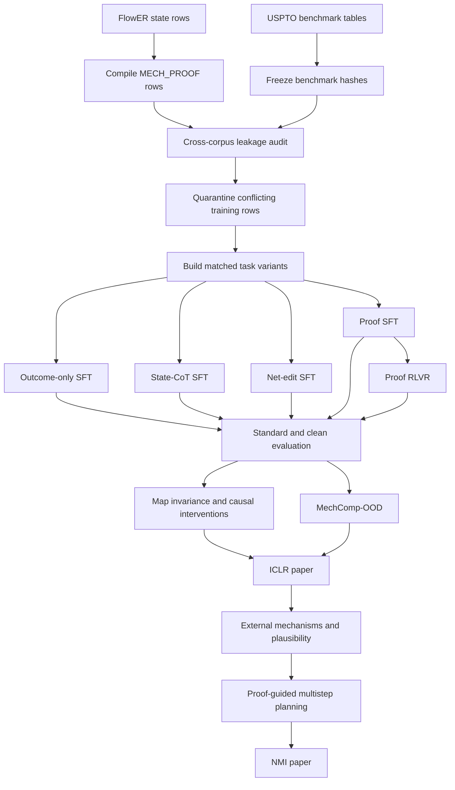

# MechET experiment plan: from ICLR method validation to NMI scientific validation

This document is the execution contract for the MechET experimental program. It separates data auditing, matched model training, proof-level evaluation, and external scientific validation so that no benchmark result is reported before its data lineage is understood.

The central method is:

```text
mapped product -> MECH_PROOF v1 -> deterministic executor -> structural precursors
```

The central experimental question for ICLR is whether executable inverse electron-flow programs improve faithfulness and compositional generalization. The NMI extension asks whether formally valid proofs are chemically plausible and useful in realistic synthesis planning.

---

## 1. Non-negotiable experimental rules

1. **Freeze benchmark hashes before training.** Test files are never filtered after model selection.
2. **Decontaminate training data, not test data.** Every removed training row is written to a quarantine file with a reason.
3. **Use structural precursor endpoints.** Free solvents, salts, catalysts, and spectators do not determine the primary endpoint score.
4. **Match rows across baselines.** Outcome-only, state-CoT, net-edit, and proof models use the same stable reaction IDs and the same structural endpoint.
5. **Match backbone and budget.** Main comparisons use the same Qwen3-8B base model, tokenizer, LoRA capacity, seeds, and assistant-token budget.
6. **Report standard and clean benchmarks separately.** Standard USPTO numbers provide literature comparability; clean splits support generalization claims.
7. **Treat atom maps as nuisance labels.** All map-invariance experiments permute product, imports, proof actions, and endpoints consistently.
8. **Do not call standard USPTO external validation.** FlowER and USPTO share a patent-data lineage until proven otherwise by the overlap audit.
9. **Do not equate formal execution with chemical plausibility.** Energetics, conditions, and precedent belong to the NMI-stage plausibility layer.
10. **Three seeds for every headline training result.** Report mean, standard deviation, and all individual runs.

---

## 2. Canonical data layout

The scripts accept arbitrary paths, but all official runs should use the following layout.

```text
data/
  mechet_sft/                         # state-annotated MECH_ET v3 rows
    train.jsonl
    valid.jsonl
    test.jsonl
  mechet_proof_sft/                   # compiled MECH_PROOF v1 rows
    train.jsonl
    valid.jsonl
    test.jsonl
  benchmarks/
    uspto50k/
      train.csv
      valid.csv
      test.csv
    uspto_mit/
      train.csv
      valid.csv
      test.csv
    uspto_full/
      train.csv
      valid.csv
      test.csv
  clean/
    exact/
    scaffold/
    reaction_center/
  iclr_tasks/
    exact/
      outcome_only.jsonl
      state_cot.jsonl
      net_edit.jsonl
      proof.jsonl
    scaffold/
    reaction_center/
  mechcomp_ood/
    train.jsonl
    valid.jsonl
    test.jsonl
```

Required row metadata where available:

```text
id
split
mapped product
full precursor/reactant multiset
structural precursor multiset
topology
source dataset
patent id
patent family
publication date
reaction class
```

If patent metadata is unavailable, the manifest must explicitly state that patent-family and temporal disjointness could not be verified.

---

## 3. End-to-end pipeline



---

# Phase 0 — Data lineage, leakage audit, and dataset freezing

No large-scale model training should begin before Phase 0 passes.

## Pipeline P0.1 — Build state-annotated and proof-only corpora

**Purpose:** create the two aligned source corpora used by all later baselines.

**Input data**

- FlowER mechanism dataset.
- Stable reaction IDs preserved from source processing.

**Scripts**

```bash
python scripts/build_mechet_sft.py \
  --flower-root /path/to/flower_new_dataset \
  --out-dir data/mechet_sft \
  --splits train valid test

python scripts/build_mechet_proof_sft.py \
  --input-dir data/mechet_sft \
  --output-dir data/mechet_proof_sft \
  --splits train valid test
```

**Outputs**

```text
data/mechet_sft/{train,valid,test}.jsonl
data/mechet_proof_sft/{train,valid,test}.jsonl
manifest files with accepted/skipped counts
```

**Acceptance gate**

- Stable IDs are preserved between state and proof rows.
- Every accepted proof executes.
- Executor-derived precursor matches the state-annotated precursor.
- Compilation failure reasons are counted and inspected.

**Compute:** CPU only; parallelize by file chunk if necessary.

---

## Pipeline P0.2 — Freeze benchmark files

**Purpose:** prevent post-training benchmark editing.

**Input data**

- USPTO-50K train/valid/test.
- USPTO-MIT and USPTO-FULL splits for secondary audit.
- Patent metadata when recoverable.

**Action**

Store read-only copies and SHA-256 hashes in the audit output. Do not modify benchmark rows after this point.

**Outputs**

```text
outputs/data_audit/benchmark_registry.json
```

The registry should record path, SHA-256, row count, field names, source URL/version, download date, and any mapping procedure.

**Implementation status:** benchmark hashes are already written by `audit_reaction_overlap.py`; a multi-benchmark registry wrapper can be added after the first audit run.

---

## Pipeline P0.3 — Cross-corpus leakage audit

**Purpose:** quantify FlowER-to-USPTO overlap before using USPTO as an evaluation set.

**Input data**

```text
data/mechet_proof_sft/train.jsonl
data/benchmarks/uspto50k/test.csv
```

Repeat for USPTO-50K train/valid, USPTO-MIT, and USPTO-FULL.

**Script**

```bash
python scripts/audit_reaction_overlap.py \
  --train data/mechet_proof_sft/train.jsonl \
  --benchmark data/benchmarks/uspto50k/test.csv \
  --benchmark-format reaction_table \
  --reaction-field reaction_smiles \
  --out-dir outputs/data_audit/flower_vs_uspto50k_test
```

**Overlap levels**

```text
exact_full
exact_structural
product
scaffold
reaction_center
proof_composition
patent
```

**Outputs**

```text
normalization_config.json
overlap_summary.json
overlap_matrix.csv
benchmark_conflicts.jsonl
sampled_product_similarity.jsonl  # optional
```

**Acceptance gate**

- Input hashes and normalization digest are present.
- Every overlap level has a count and denominator.
- Missing patent metadata is explicitly reported.
- Audit output is immutable and archived with the paper artifacts.

**Compute:** CPU; exact keys are inexpensive, fingerprint similarity may require several CPU hours for large corpora.

---

## Pipeline P0.4 — Build decontaminated training sets

**Purpose:** remove conflicting training rows while leaving benchmark files untouched.

**Script**

```bash
python scripts/build_decontaminated_dataset.py \
  --train data/mechet_proof_sft/train.jsonl \
  --benchmark data/benchmarks/uspto50k/test.csv \
  --output data/clean/exact/proof_train.jsonl \
  --manifest data/clean/exact/proof_manifest.json \
  --policy exact_structural product
```

Build three official policies:

| Clean set | Removal policy |
|---|---|
| `exact` | `exact_structural`, `product` |
| `scaffold` | exact policy + `scaffold` |
| `reaction_center` | scaffold policy + `reaction_center` |

Apply the same removed stable IDs to the state-annotated corpus.

**Outputs**

```text
data/clean/<policy>/proof_train.jsonl
data/clean/<policy>/state_train.jsonl
*.quarantine.jsonl
manifest.json
```

**Acceptance gate**

- No selected conflict key remains between clean train and frozen test.
- Quarantine count equals original rows minus retained rows.
- Proof and state clean sets contain identical stable IDs.

**Compute:** CPU only.

---

## Pipeline P0.5 — Build map-permuted controls

**Purpose:** test whether performance depends on arbitrary atom-map labels.

**Input data**

- Clean proof valid/test rows.

**Script**

```bash
python scripts/build_map_permutations.py \
  --input data/clean/exact/proof_test.jsonl \
  --output-dir data/clean/exact/map_controls \
  --seeds 1 2 3 4 5
```

**The permutation must cover**

- product maps;
- proof imports;
- `BOND`, `LP`, and `CHARGE` maps;
- full precursor;
- structural precursor.

**Outputs**

```text
map_seed1.jsonl
...
map_seed5.jsonl
map_manifest.json
```

**Acceptance gate**

- Every permuted gold proof still executes.
- Endpoint chemistry is unchanged after removing maps.
- Composition signatures are unchanged.

**Compute:** CPU only.

---

# Phase 1 — Matched supervised baselines

## Pipeline P1.1 — Build matched task variants

**Purpose:** ensure all baselines see exactly the same reactions and structural endpoints.

**Input data**

```text
data/clean/<policy>/proof_train.jsonl
data/clean/<policy>/state_train.jsonl
```

**Script**

```bash
python scripts/build_iclr_task_variants.py \
  --proof-input data/clean/exact/proof_train.jsonl \
  --state-input data/clean/exact/state_train.jsonl \
  --output-dir data/iclr_tasks/exact
```

**Output datasets**

| File | Assistant target |
|---|---|
| `outcome_only.jsonl` | structural precursor SMILES |
| `state_cot.jsonl` | MECH_ET v3 trajectory + structural precursor |
| `net_edit.jsonl` | net bond/charge edit program + structural precursor |
| `proof.jsonl` | MECH_PROOF v1 only; no answer channel |

**Data contract check**

```bash
python scripts/validate_iclr_data_contract.py \
  --task outcome=data/iclr_tasks/exact/outcome_only.jsonl \
  --task state=data/iclr_tasks/exact/state_cot.jsonl \
  --task edit=data/iclr_tasks/exact/net_edit.jsonl \
  --task proof=data/iclr_tasks/exact/proof.jsonl \
  --out outputs/iclr/exact/data_contract.json
```

**Acceptance gate**

- Identical stable ID set across all tasks.
- Identical structural endpoint for every ID.
- No assistant target is empty.
- Proof rows contain no independent `<answer>` block.

---

## Pipeline P1.2 — Train outcome-only baseline

**Dataset**

```text
data/iclr_tasks/<policy>/outcome_only.jsonl
```

**Config**

```text
configs/iclr/outcome_only_sft.yaml
```

**Training script**

```bash
python scripts/train_mechet_sft.py --config configs/iclr/outcome_only_sft.yaml
```

**Model**

- Qwen3-8B.
- QLoRA, rank 16, alpha 32, dropout 0.05.
- Seeds 11, 22, 33.

**Loss**

Assistant-only causal token cross-entropy:

```text
L_SFT = -sum_t I[t in assistant] log p(y_t | x, y_<t)
```

**Output**

```text
outputs/iclr/<policy>/outcome_only/seed_<seed>/adapter
training_metrics.json
run_manifest.json
```

---

## Pipeline P1.3 — Train state-CoT baseline

**Dataset**

```text
data/iclr_tasks/<policy>/state_cot.jsonl
```

**Config**

```text
configs/iclr/state_cot_sft.yaml
```

**Script**

```bash
python scripts/train_mechet_sft.py --config configs/iclr/state_cot_sft.yaml
```

**Model and loss**

Same Qwen3-8B, QLoRA capacity, seeds, and assistant-only token CE as outcome-only.

**Fairness requirement**

Report both optimizer steps and total non-masked assistant tokens. The headline comparison should match assistant-token budget because state-CoT sequences are substantially longer.

---

## Pipeline P1.4 — Train net-edit baseline

**Dataset**

```text
data/iclr_tasks/<policy>/net_edit.jsonl
```

**Config**

```text
configs/iclr/net_edit_sft.yaml
```

**Script**

```bash
python scripts/train_mechet_sft.py --config configs/iclr/net_edit_sft.yaml
```

**Purpose**

Separate the value of a sparse executable mechanism proof from the simpler benefit of predicting net graph edits.

**Model and loss**

Same Qwen3-8B QLoRA and assistant-only token CE.

---

## Pipeline P1.5 — Train proof-SFT

**Dataset**

```text
data/iclr_tasks/<policy>/proof.jsonl
```

**Config**

```text
configs/iclr/proof_sft_clean.yaml
```

**Script**

```bash
python scripts/train_mechet_sft.py --config configs/iclr/proof_sft_clean.yaml
```

**Target**

Only `MECH_PROOF v1`; no generated precursor answer.

**Loss**

Same assistant-only token CE.

**Primary pilot gate**

On the overfit/smoke split:

- proof parse rate > 95%;
- proof execute rate rises substantially above the base model;
- no `<answer>` bypass appears.

---

## Pipeline P1.6 — Optional from-scratch representation control

**Purpose:** test whether proof benefits persist without possible foundation-model pretraining contamination.

**Dataset**

Use the same matched `outcome_only` and `proof` rows at 1%, 5%, 10%, 25%, and 100% data fractions.

**Model**

A small randomly initialized decoder-only Transformer with identical tokenizer and parameter count across the two tasks.

**Status**

Not yet implemented in PR #5. Add a dedicated training script only after the Qwen matched baselines and leakage audit are stable.

---

# Phase 2 — Proof-aware reinforcement learning

## Pipeline P2.1 — Proof-RLVR training

**Initialization**

- Best validation checkpoint from proof-SFT.

**Dataset**

```text
data/iclr_tasks/<policy>/proof.jsonl
```

**Config**

```text
configs/iclr/proof_rlvr_clean.yaml
```

**Script**

```bash
python scripts/train_iclr_proof_rlvr.py \
  --config configs/iclr/proof_rlvr_clean.yaml \
  --dry-run

python scripts/train_iclr_proof_rlvr.py \
  --config configs/iclr/proof_rlvr_clean.yaml
```

**Algorithm**

- Current-policy group sampling.
- Group size 8.
- RLOO/group-relative advantages.
- Length-normalized sequence log probability.
- LoRA parameters only.

**Reward**

```text
missing proof:              -4.0
parseable but nonexecuting: -2.0
execute:                    +2.5
structural endpoint exact:  +4.0
composition match:          +1.0 auxiliary
```

**Policy objective**

```text
L_RLVR = -mean_i A_i * mean_t log p(y_i,t | x, y_i,<t)
```

This is group-relative REINFORCE/RLOO-style RLVR, not clipped PPO and not full GRPO.

**Logged metrics**

```text
reward_mean
execute_rate
endpoint_core_exact_rate
composition_match_rate
effective_group_rate
mean_completion_tokens
```

**Acceptance gate**

- `effective_group_rate` remains meaningfully above zero.
- Execute rate improves over proof-SFT without collapsing diversity.
- Structural endpoint accuracy does not decline substantially.
- No reward is assigned from free spectator agreement.

**Compute recommendation**

- Smoke: 1 GPU with QLoRA.
- Pilot: 4 GPUs.
- Headline run: 8 GPUs recommended because online group sampling is the bottleneck.

---

# Phase 3 — ICLR evaluation pipelines

## Pipeline P3.1 — Standard and clean endpoint evaluation

**Test sets**

```text
USPTO-50K standard
USPTO-50K exact-clean training condition
USPTO-50K scaffold-clean training condition
USPTO-50K reaction-center-clean training condition
FlowER internal test
```

The frozen USPTO test file stays identical across all conditions; only the training set changes.

**Metrics for all methods**

```text
structural precursor top-1/top-k exact match
max-fragment accuracy
round-trip accuracy when a fixed forward model is available
valid output rate
sequence length
inference latency
```

**Proof-specific metrics**

```text
format_ok
execute_ok
endpoint_exact
proof_equivalent_to_gold
composition_match
repair_changed
```

**Available proof evaluator**

```bash
python scripts/eval_mechet_proof_generations.py \
  --data data/iclr_tasks/exact/proof_test.jsonl \
  --predictions outputs/iclr/exact/proof/generations.jsonl \
  --attempt-local-repair \
  --out outputs/iclr/exact/proof/eval.json
```

**Implementation gap**

A unified evaluator for outcome-only, state-CoT, and net-edit outputs should be added in a follow-up PR so all methods share the same structural-endpoint canonicalizer and top-k implementation.

---

## Pipeline P3.2 — Atom-map invariance

**Datasets**

- Canonical-map test.
- Five matched map-permuted test sets from P0.5.

**Models**

All five trained models.

**Metrics**

```text
endpoint score drop under map permutation
proof execute-rate drop
composition-signature invariance
prediction consistency across five permutations
```

**Primary statistic**

```text
Delta_map = canonical score - mean(permuted scores)
```

---

## Pipeline P3.3 — Causal proof interventions

**Purpose:** show that proof operations causally determine execution rather than serving as decorative text.

**Interventions**

```text
delete one BOND action
change one atom map
swap two dependent edges
swap two commuting edges
tamper one LP line
tamper one CHARGE transition
delete one IMPORT
create a DAG-join conflict
```

**Expected behavior**

- Dependent or chemistry-changing interventions should be rejected.
- Commuting-event reorderings should remain equivalent.
- LP-only certificate errors may be deterministically repaired.

**Metrics**

```text
false acceptance rate
failure localization accuracy
repair success rate
dependent-order sensitivity
commuting-order invariance
```

**Implementation gap**

The verifier and repair infrastructure exists. Add a dataset-level intervention generator and evaluator in a follow-up PR.

---

## Pipeline P3.4 — MechComp-OOD

**Purpose:** test seen elementary primitives in unseen full mechanism compositions.

**Input**

```text
data/mechet_proof_sft/train.jsonl
```

**Script**

```bash
python scripts/build_mechcomp_ood.py \
  --input data/mechet_proof_sft/train.jsonl \
  --output-dir data/mechcomp_ood \
  --test-fraction 0.10 \
  --valid-fraction 0.10 \
  --min-train-primitive-count 5 \
  --seed 42
```

**Models**

```text
outcome-only
state-CoT
net-edit
proof-SFT
proof-RLVR
```

**Metrics**

```text
structural endpoint accuracy
proof execute rate
primitive accuracy
composition match
partial-order proof equivalence
```

Stratify by proof length, DAG depth, branching factor, and primitive rarity.

**Acceptance gate**

- Zero complete-composition overlap between train and held-out sets.
- Every held-out primitive has the minimum required train support.

---

## Pipeline P3.5 — Low-resource and efficiency study

**Data fractions**

```text
1%, 5%, 10%, 25%, 100%
```

**Models**

At minimum outcome-only, state-CoT, net-edit, and proof-SFT. Run proof-RLVR at 10% and 100% first.

**Metrics**

```text
endpoint accuracy
execute rate
MechComp-OOD score
tokens per sample
training tokens
GPU hours
peak memory
inference latency
executor overhead
```

**Scientific question**

Does decomposing reactions into reusable executable primitives improve data efficiency, especially under composition shift?

---

# Phase 4 — ICLR result package

The ICLR paper should be considered complete only when the following result blocks exist.

| Result block | Required evidence |
|---|---|
| Faithfulness by construction | answer bypass impossible; intervention false-acceptance analysis |
| Matched baseline comparison | identical IDs/endpoints/backbone/budget, three seeds |
| Leakage-clean evaluation | standard + exact/scaffold/center-clean results and overlap matrix |
| MechComp-OOD | primitive-seen/composition-unseen benchmark |
| Map invariance | five consistent map permutations |
| Training analysis | SFT vs RLVR, effective-group rate, length and compute |

Recommended headline models:

```text
Outcome-only Qwen3-8B QLoRA
State-CoT Qwen3-8B QLoRA
Net-edit Qwen3-8B QLoRA
MECH_PROOF-SFT Qwen3-8B QLoRA
MECH_PROOF-RLVR Qwen3-8B QLoRA
```

---

# Phase 5 — NMI scientific validation

NMI should extend the ICLR method rather than repeat it with more USPTO tables.

## Pipeline P5.1 — Independent external mechanism benchmark

**Datasets**

- Open Reaction Database subsets with reliable structural records.
- Post-training-cutoff literature reactions.
- Expert-curated textbook and named-reaction mechanisms.
- Organometallic, radical, rearrangement, pericyclic, and cascade cases absent from the patent-derived training distribution.

**Required metadata**

```text
source citation
publication date
reactants/products
conditions
reference mechanism or accepted alternatives
expert confidence
```

**New scripts required**

```text
scripts/build_external_mechanism_benchmark.py
scripts/eval_external_mechanisms.py
```

These are not yet implemented.

---

## Pipeline P5.2 — Formal validity versus chemical plausibility

**Formal layer**

- Existing deterministic executor/verifier.

**Plausibility layer**

Possible components:

```text
reaction precedent retrieval
nucleophile/electrophile compatibility
leaving-group feasibility
condition compatibility
elementary-step learned score
xTB/DFT ranking on a small subset
expert score
```

**Experimental design**

Report formal execution and chemical plausibility separately. Do not allow a learned plausibility critic to redefine formal proof correctness.

**New code required**

```text
src/mechet/plausibility.py
scripts/score_proof_plausibility.py
```

---

## Pipeline P5.3 — Proof-guided multistep planning

**Task**

Each retrosynthetic expansion returns:

```text
precursors + executable proof certificate
```

Only verified expansions enter the search frontier.

**Datasets**

- PaRoutes after target-overlap audit.
- Independent post-cutoff target set.

**Baselines**

```text
outcome-only planner
forward-scored planner
proof-filtered planner
proof-scored planner
```

**Metrics**

```text
solved target rate
verified route rate
invalid expansion rate
branching factor
route length
route diversity
model calls
wall-clock
fraction of route steps with executable proofs
```

**New code required**

```text
src/mechet/planning/
scripts/run_proof_guided_planning.py
```

---

## Pipeline P5.4 — Blind expert review

**Cases**

Blindly sample predictions from outcome-only, state-CoT, proof-SFT, proof-RLVR, and reference mechanisms.

**Expert questions**

```text
Are elementary steps chemically reasonable?
Are intermediates plausible?
Are conditions compatible?
Is the endpoint a reasonable alternative disconnection?
Would the proposal be useful for synthesis planning?
```

**Statistics**

- At least two independent expert raters.
- Inter-rater agreement.
- Bootstrap confidence intervals.
- Separate exact-reference and valid-alternative cases.

---

# 6. Run order and stopping gates

## Stage A — CPU-only audit

Run P0.1–P0.5. Do not train if:

- IDs cannot be matched between state and proof corpora;
- test hashes are not frozen;
- decontamination policies leave selected conflicts;
- map-permuted gold proofs fail execution.

## Stage B — Smoke models

For each SFT task:

```text
32–128 training examples
1 seed
short run
```

Do not scale if assistant labels are empty, targets differ across tasks, or proof-SFT cannot overfit the smoke split.

## Stage C — Pilot

```text
5–10% clean training data
seeds 11 and 22
one clean policy
```

Use the pilot to choose sequence lengths, learning rates, and RLVR group size. Do not use test data for these choices.

## Stage D — ICLR headline runs

```text
100% exact-clean
100% scaffold-clean
3 seeds
all five models
```

Run reaction-center-clean and low-resource studies after the main exact/scaffold matrix is stable.

## Stage E — NMI expansion

Begin only after the ICLR pipeline is frozen and external datasets are independently sourced.

---

# 7. Recommended experiment registry

Every run should produce a manifest with:

```text
run_id
git commit
model/base checkpoint
adapter initialization
dataset path and SHA-256
benchmark registry SHA-256
clean policy
stable row-ID digest
normalization digest
seed
config file
hardware
start/end time
training tokens
GPU hours
checkpoint path
metrics path
```

The existing SFT and RLVR scripts already write portions of this information. The official experiment launcher should refuse to run when the data-contract report or benchmark hash is missing.

---

# 8. Immediate next commands

Run these before any full training:

```bash
# 1. Audit FlowER-derived proof train against frozen USPTO-50K test.
python scripts/audit_reaction_overlap.py \
  --train data/mechet_proof_sft/train.jsonl \
  --benchmark data/benchmarks/uspto50k/test.csv \
  --benchmark-format reaction_table \
  --reaction-field reaction_smiles \
  --out-dir outputs/data_audit/flower_vs_uspto50k_test

# 2. Build exact-clean proof train.
python scripts/build_decontaminated_dataset.py \
  --train data/mechet_proof_sft/train.jsonl \
  --benchmark data/benchmarks/uspto50k/test.csv \
  --output data/clean/exact/proof_train.jsonl \
  --manifest data/clean/exact/proof_manifest.json \
  --policy exact_structural product

# 3. Apply the same retained IDs to the state corpus, then build matched tasks.
python scripts/build_iclr_task_variants.py \
  --proof-input data/clean/exact/proof_train.jsonl \
  --state-input data/clean/exact/state_train.jsonl \
  --output-dir data/iclr_tasks/exact

# 4. Validate baseline alignment.
python scripts/validate_iclr_data_contract.py \
  --task outcome=data/iclr_tasks/exact/outcome_only.jsonl \
  --task state=data/iclr_tasks/exact/state_cot.jsonl \
  --task edit=data/iclr_tasks/exact/net_edit.jsonl \
  --task proof=data/iclr_tasks/exact/proof.jsonl \
  --out outputs/iclr/exact/data_contract.json
```

Only after all four commands pass should the matched SFT smoke runs begin.
